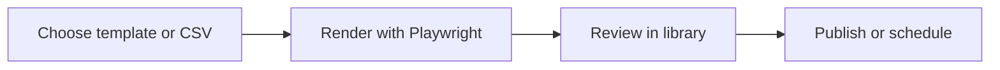

# Social Thumbnail Publisher

<p align="center">
  <strong>A Flask workspace for generating reusable thumbnails and publishing or scheduling Facebook Page content.</strong>
</p>

<p align="center">
  
  
  
</p>

## Overview

This application combines template-based thumbnail production with a social publishing workflow. Users can manage HTML templates, create image assets from structured input, keep a local library, and prepare Facebook Page posts from one dashboard.

## The problem

Creating repeated social graphics and then moving them into a separate publishing interface adds unnecessary manual work.

## The solution

The Flask dashboard keeps templates, generated thumbnails, content details, and publishing actions in one local workflow. Playwright renders HTML designs into consistent PNG output.

## What it demonstrates

- Flask application development
- Browser-based rendering with Playwright
- Template and asset management
- Facebook Graph API workflow design
- Local JSON-backed application state

## Core capabilities

| Capability | Practical value |
|---|---|
| HTML thumbnail templates | Reusable layouts for multiple visual styles and aspect ratios |
| Automated rendering | Playwright converts templates into PNG assets |
| Content library | Stores and organizes generated items |
| CSV workflow | Supports structured batch input |
| Facebook publishing | Prepares immediate or scheduled Page posts |
| Docker support | Includes a container configuration |

## Workflow



## Technology

- Python
- Flask
- Playwright
- HTML and CSS templates
- Facebook Graph API
- Docker

## Project status

**Functional local application requiring hardening**

Before production use, move the Flask secret and every provider token into environment variables, replace JSON credential storage, add authentication, and validate uploaded templates.

## Run locally

```bash
git clone https://github.com/nasratulnayem/social-thumbnail-publisher.git
cd social-thumbnail-publisher
python -m venv .venv
source .venv/bin/activate
pip install -r requirements.txt
python app.py
```

## Usage

Open the Flask dashboard, select or manage a thumbnail template, create the asset, then prepare the related Facebook Page post.

## Engineering notes

- Configuration and credentials should be supplied through environment variables or local files excluded from Git.
- Generated output and runtime data should not be committed.
- Claims in this README describe the capabilities visible in this repository.
- Before production deployment, review authentication, rate limits, error handling, logging, and provider terms.

## Roadmap

- [ ] Replace hardcoded secret configuration
- [ ] Encrypt or externalize provider credentials
- [ ] Add authentication and CSRF protection
- [ ] Add test coverage for rendering and publishing

## About the developer

Built by **Nasratul Nayem**, a WordPress, WooCommerce, and automation developer based in Dhaka, Bangladesh.

I build practical systems that remove repetitive work: WordPress plugins, WooCommerce integrations, browser extensions, Python automation, AI-assisted content pipelines, and internal business tools.

- Portfolio: [nayem.dev](https://nayem.dev)
- GitHub: [@nasratulnayem](https://github.com/nasratulnayem)
- LinkedIn: [Nasratul Nayem](https://www.linkedin.com/in/nasratulnayem)

## License

Review the repository license before reuse. Third-party services and APIs remain subject to their own terms.
